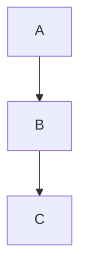

# vaultpub

Publish a local Obsidian vault as a browsable, searchable web site.

vaultpub is **not** an Obsidian Publish client. It does not require an Obsidian account, subscription, or official servers. It works entirely locally with your vault files.

## Table of Contents

1. [Quick Start](#quick-start)
2. [CLI Commands](#cli-commands)
3. [Configuration](#configuration)
4. [Obsidian Syntax Support](#obsidian-syntax-support)
5. [Django Integration](#django-integration)
6. [Python API](#python-api)
7. [Static Export](#static-export)
8. [Realtime Updates](#realtime-updates)
9. [Security](#security)
10. [Frontend Features](#frontend-features)
11. [Troubleshooting](#troubleshooting)
12. [Development](#development)
13. [License](#license)

---

## Quick Start

### Installation

```bash
pip install vaultpub
```

### Serve a vault

```bash
vaultpub serve --vault ~/my-vault --port 8008
```

Open `http://127.0.0.1:8008` in your browser. The home page is determined by:

1. `home_file` config option
2. `README.md` in vault root
3. `index.md` in vault root
4. `Home.md` in vault root
5. First visible Markdown file

### Create a config file

```bash
vaultpub init --vault ~/my-vault
```

This creates `.vaultpub.yml` in your vault root with sensible defaults.

---

## CLI Commands

### `vaultpub serve`

Start a development web server.

```bash
vaultpub serve \
  --vault ~/Vault \
  --host 127.0.0.1 \
  --port 8008 \
  --home README \
  --reload
```

| Option | Default | Description |
| -------- | --------- | ------------- |
| `--vault` | (required) | Path to Obsidian vault |
| `--host` | `127.0.0.1` | Bind address |
| `--port` | `8008` | Bind port |
| `--home` | (auto) | Home file stem, e.g. `README` |
| `--reload` | `false` | Auto-reload on code changes |
| `--config` | (auto) | Path to `.vaultpub.yml` |
| `--force-include-regex` | none | Regex to force-include non-Markdown text files (repeatable). See `--help` for examples |
| `--force-exclude-regex` | none | Regex to force-exclude paths from publishing (repeatable). See `--help` for examples |

### `vaultpub build`

Export a static HTML site for deployment.

```bash
vaultpub build \
  --vault ~/Vault \
  --out ./public \
  --clean \
  --base-url https://notes.example.com
```

| Option | Default | Description |
| -------- | --------- | ------------- |
| `--vault` | (required) | Path to Obsidian vault |
| `--out` | `./public` | Output directory |
| `--clean` | `false` | Remove output dir before building |
| `--base-url` | (none) | Base URL for sitemap/RSS/canonical links |
| `--config` | (auto) | Path to `.vaultpub.yml` |
| `--force-include-regex` | none | Regex to force-include non-Markdown text files (repeatable) |
| `--force-exclude-regex` | none | Regex to force-exclude paths from publishing (repeatable) |

Output structure:

```text
public/
  index.html                  # Home page
  README/index.html           # Pretty URL for each note
  Folder/My Note/index.html
  tags/project/demo/index.html  # Tag pages
  assets/...                  # Copied attachments
  static/vaultpub/
    app.css                   # Frontend styles
    app.js                    # Frontend scripts
    assets/...                # Frontend chunks and fonts
  search-index.json           # Client-side search data
  graph.json                  # Graph visualization data
  sitemap.xml                 # SEO sitemap (when --base-url is set)
  rss.xml                     # RSS feed
  robots.txt
```

### `vaultpub index`

Export the vault index as JSON for inspection or external tools.

```bash
vaultpub index --vault ~/Vault --json ./index.json
```

| Option | Default | Description |
| ------ | ------------- | ----------- |
| `--vault` | (required) | Path to Obsidian vault |
| `--json` | `./index.json` | Output JSON file path |
| `--config` | (auto) | Path to `.vaultpub.yml` |
| `--force-include-regex` | none | Regex to force-include non-Markdown text files (repeatable) |
| `--force-exclude-regex` | none | Regex to force-exclude paths from publishing (repeatable) |

### `vaultpub doctor`

Diagnose vault issues: broken links, duplicate stems, duplicate permalinks.

```bash
vaultpub doctor --vault ~/Vault
```

Example output:

```text
Notes: 42
Attachments: 15
Tags: 8
Permalinks: 2

Broken links (3):
  Folder/Note.md -> [[MissingPage]] (Target not found)
  ...

Duplicate stems (1):
  notes: 2 notes
```

### `vaultpub init`

Create a default `.vaultpub.yml` configuration file in a vault directory.

```bash
vaultpub init --vault ~/Vault
```

---

## Configuration

### YAML file (`.vaultpub.yml`)

Place `.vaultpub.yml` in your vault root. vaultpub also checks `.obsidian-publish.yml` as a fallback for migration compatibility.

```yaml
# Path to the vault (can be relative to config file location)
vault_path: .

# Site metadata
site:
  name: My Knowledge Base
  title: My KB
  description: Personal notes and research
  url: https://notes.example.com
  logo: assets/logo.svg
  image: assets/og-image.png
  type: article

# URL routing
routing:
  prefix: /
  home_file: README
  url_style: path          # "path" | "publish" | "slug"

# Publishing controls
publish:
  mode: publish_false_hides  # "all" | "publish_true" | "publish_false_hides"
  include_folders: []
  exclude_folders:
    - .obsidian
    - .git
    - private
    - trash
  exclude_globs:
    - "**/*.draft.md"
    - "**/archive/**"

# Markdown rendering
rendering:
  strict_line_breaks: true
  readable_line_length: true
  hide_title: false
  html_safe_mode: true       # Sanitize raw HTML
  allow_raw_html: false
  enable_mermaid: true
  enable_math: true
  enable_callouts: true

# Feature toggles
features:
  navigation: true
  search: true
  graph: true
  local_graph: true
  toc: true
  backlinks: true
  unlinked_mentions: false
  hover_preview: true
  theme_toggle: true
  stacked_pages: false

# Real-time file watching (serve mode only)
realtime:
  enabled: true
  transport: auto            # "auto" | "sse" | "websocket" | "poll"
  debounce_ms: 150
```

### Publish Modes

| Mode | Behavior |
| ---- | ------------ |
| `publish_false_hides` (default) | All notes published unless `publish: false` in frontmatter |
| `publish_true` | Only notes with `publish: true` in frontmatter are published |
| `all` | All notes published regardless of frontmatter |

### Force include/exclude patterns

All CLI commands that scan the vault (`serve`, `build`, `index`) accept `--force-include-regex` and `--force-exclude-regex` options (repeatable). These provide regex-based overrides on top of the normal publish/exclude rules:

```bash
# Publish Python files as code pages
vaultpub serve --vault ~/Vault --force-include-regex '.*\.py$'

# Exclude anything in paths containing "secret"
vaultpub serve --vault ~/Vault --force-exclude-regex '(^|/)secret(/|$)'

# Combine both
vaultpub serve --vault ~/Vault \
  --force-include-regex '.*\.py$' \
  --force-exclude-regex '(^|/)secret(/|$)'
```

- Patterns use regex search semantics (partial match), not full-string match
- `--force-exclude-regex` wins over `--force-include-regex` when both match the same path
- Hidden files and always-forbidden paths (`.obsidian/`, `.git/`, `metadata.json`, etc.) are excluded regardless
- Add patterns in config under `publish.exclude_globs` for persistent YAML-based config instead of CLI flags

### Environment Variables

Perlite-compatible environment variables are supported for Docker deployments:

| Variable | Config field | Type |
| ---------- | ------------- | ---- |
| `NOTES_PATH` | `vault_path` | path |
| `SITE_TITLE` | `site_title` | string |
| `SITE_URL` | `site_url` | string |
| `SITE_DESC` | `site_description` | string |
| `SITE_NAME` | `site_name` | string |
| `SITE_LOGO` | `site_logo` | string |
| `SITE_IMAGE` | `site_image` | string |
| `SITE_TYPE` | `site_type` | string |
| `HOME_FILE` | `home_file` | string |
| `SHOW_TOC` | `show_toc` | boolean |
| `SHOW_LOCAL_GRAPH` | `show_local_graph` | boolean |
| `HIDE_FOLDERS` | `exclude_folders` | comma-separated |
| `HIDDEN_FILE_ACCESS` | `hidden_file_access` | boolean |
| `HTML_SAFE_MODE` | `html_safe_mode` | boolean |
| `LINE_BREAKS` | `strict_line_breaks` | boolean |
| `FONT_SIZE` | `font_size` | integer |
| `ALLOWED_FILE_LINK_TYPES` | `allowed_attachment_types` | comma-separated |
| `DISABLE_POP_HOVER` | `show_hover_preview` | inverted boolean |

### Frontmatter

Individual notes can override behavior via YAML frontmatter:

```yaml
---
title: Custom Page Title
aliases:
  - Old Name
  - Alternative Name
tags:
  - project/demo
  - reference
publish: false          # Hide this note
permalink: custom-path  # Canonical URL override
description: SEO description for this page
image: assets/card.png  # OpenGraph image
cover: assets/cover.png
cssclasses:
  - wide-page
---
```

---

## Obsidian Syntax Support

### Wikilinks

```markdown
[[Note]]                    → Link to "Note"
[[Note|Display Text]]       → Link with custom text
[[Folder/Note]]             → Cross-folder link
[[Note#Heading]]            → Link to heading anchor
[[Note#^block-id]]          → Link to block reference
[[#Current Page Heading]]   → Same-page heading link
```

Unresolved links render with `class="internal-link is-unresolved"` and a strikethrough style.

### Embeds

```markdown
![[image.png]]              → Image embed
![[image.png|300]]          → Image with width
![[image.png|300x200]]      → Image with width × height
![[audio.mp3]]              → Audio player
![[video.mp4]]              → Video player
![[document.pdf]]           → PDF iframe
![[tool.py]]                → Embedded code page (when force-included)
![[Other Note]]             → Note content embed (max depth: 5)
![[Other Note#Heading]]     → Heading section embed
```

Local file targets resolve relative to the current note by default. Root-relative paths like `/subdir/image.png` resolve from the vault root.

Standard Markdown links and images are also canonicalized to published URLs:

```markdown
            → /assets/current/dir/image.png
[Document](./doc.pdf)       → /assets/current/dir/doc.pdf
[Archive](./archive.pin.gz) → /assets/current/dir/archive.pin.gz (download link)
[Tool](./tool.py)           → /current/dir/tool.py
[Note](./Other.md)          → /current/dir/Other.md
```

Standard Markdown image syntax only inlines image attachments. When it targets a non-image local file, vaultpub degrades it to a normal link; download-only attachments such as `.gz`, `.zip`, and `.tar` become download links automatically.

Common download attachments are published by default: `.gz`, `.tgz`, `.zip`, `.tar`, `.bz2`, `.xz`, `.7z`. To extend the published attachment list, set `publish.allowed_attachment_types` in YAML or `ALLOWED_FILE_LINK_TYPES` in the environment.

### Callouts

```markdown
> [!note] Title
> Content here

> [!tip] Pro tip
> Useful information

> [!warning]- Collapsed by default
> Hidden until clicked

> [!danger] Critical
> Pay attention
```

Supported types: `note`, `abstract`/`summary`/`tldr`, `info`, `todo`, `tip`/`hint`/`important`, `success`/`check`/`done`, `question`/`help`/`faq`, `warning`/`caution`/`attention`, `failure`/`fail`/`missing`, `danger`/`error`, `bug`, `example`, `quote`/`cite`.

Fold state: `+` = expanded (default), `-` = collapsed.

### Mermaid Diagrams

````markdown

````

Rendered client-side. Requires the frontend JS bundle.

### Math (LaTeX)

```markdown
Inline: $E = mc^2$

Block:
$$
\int_0^\infty e^{-x^2} dx = \frac{\sqrt{\pi}}{2}
$$
```

Rendered client-side with KaTeX.

### Tags

```markdown
---
tags:
  - project/demo
  - reference
---

Body tags: #inline-tag #nested/path
```

Tags appear on tag pages at `/tags/<tag-name>/`.

### Comments

```markdown
%% This text is hidden in published output %%
```

### Backlinks

Automatically generated for every note. A note's backlinks section shows all notes that link to it. Hover preview is supported on backlinks.

---

## Django Integration

### Setup

```python
# settings.py
INSTALLED_APPS = [
    # ...
    "vaultpub.django_app",
]

VAULTPUB = {
    "default": {
        "vault_path": "/srv/notes/vault",
        "url_prefix": "/notes/",
        "home_file": "README",
        "site_name": "My Knowledge Base",
        "show_graph": True,
        "show_backlinks": True,
        "show_search": True,
        "show_toc": True,
        "show_theme_toggle": True,
    }
}
```

```python
# urls.py
from django.urls import include, path

urlpatterns = [
    path("notes/", include("vaultpub.django_app.urls")),
]
```

Set `VAULTPUB["default"]["url_prefix"]` to the same mount path used in `include()`. vaultpub uses this prefix when rendering note links and API URLs.

### URL Routes

| Route | Purpose |
| ----- | ------- |
| `/notes/` | Home page |
| `/notes/README` | Note page |
| `/notes/api/page/README` | Note JSON API |
| `/notes/api/search?q=term` | Search API |
| `/notes/api/graph` | Graph data API |
| `/notes/api/graph/local/README` | Local graph API |
| `/notes/assets/image.png` | Attachment serving |

### Template Customization

The Django views use Django's template engine with `vaultpub/page.html` as the entry point. To customize the look and feel, copy the default templates into your project's `templates/` directory and modify them — Django will pick up your versions automatically.

**Quick start — copy all default templates:**

```bash
# Find the vaultpub package path
VAULTPUB_DIR=$(python -c "import vaultpub; print(vaultpub.__path__[0])")

# Copy templates to your project
cp -r "$VAULTPUB_DIR/django_app/templates/vaultpub" your_project/templates/
```

Then edit the copied files in `your_project/templates/vaultpub/` to match your design. No additional configuration is needed — Django's template loader finds your versions first.

**Overridable templates:**

| Template path | Purpose |
| --------------- | ------- |
| `vaultpub/base.html` | Full page layout (top bar, sidebars, content area) |
| `vaultpub/page.html` | Note page (extends `base.html`) |
| `vaultpub/partials/nav.html` | Left sidebar file navigation |
| `vaultpub/partials/toc.html` | Right sidebar table of contents |
| `vaultpub/partials/backlinks.html` | Right sidebar backlinks |
| `vaultpub/partials/graph.html` | Right sidebar graph container |
| `vaultpub/partials/search.html` | Search modal markup |

**Template context variables:**

| Variable | Type | Description |
| ---------- | ---- | ------------- |
| `content` | `str` | Rendered note body HTML (markdown → HTML, safe) |
| `seo_head` | `str` | Complete `<title>` + meta/OG/Twitter tags |
| `nav_html` | `str` | File tree navigation as `<ul>` HTML |
| `toc_html` | `str` | Table of contents as `<nav>` HTML |
| `backlinks_html` | `str` | Backlinks as `<section>` HTML |
| `note_id` | `str` | Stable SHA-1 identifier for the note |
| `url_path` | `str` | Canonical public URL path, including Django prefix |
| `url_prefix` | `str` | Django mount prefix (e.g. `/notes/`) |
| `title` | `str` | Page title (from frontmatter, H1, or filename) |
| `site_name` | `str` | From config `site.name` |
| `site_logo` | `str` or `None` | From config `site.logo` |
| `description` | `str` | SEO description |
| `realtime` | `bool` | Whether real-time updates are enabled |
| `show_graph` | `bool` | Whether to show the graph container |
| `show_search` | `bool` | Whether to show the search trigger |
| `show_theme_toggle` | `bool` | Whether to show the theme toggle button |

---

## Python API

### Configure and render

```python
from vaultpub import PublisherConfig
from vaultpub.core.index.indexer import VaultIndexer
from vaultpub.core.render import Renderer

config = PublisherConfig(vault_path="/srv/notes")
indexer = VaultIndexer(config)
vault_index = indexer.build()
renderer = Renderer(config, vault_index)

# Render a specific note
note = vault_index.notes_by_path["README.md"]
html = renderer.render_note(note)
full_page = renderer.render_page_html(note)
```

### Standalone ASGI app

```python
from vaultpub import PublisherConfig
from vaultpub.web import create_app

config = PublisherConfig(vault_path="/srv/notes")
app = create_app(config)

# Run with uvicorn:
# uvicorn my_module:app --port 8008
```

### Static export

```python
from vaultpub import PublisherConfig
from vaultpub.export import StaticSiteBuilder

config = PublisherConfig(
    vault_path="/srv/notes",
    site_url="https://notes.example.com",
)
builder = StaticSiteBuilder(config)
result = builder.build(out_dir="./public", clean=True)
print(f"Wrote {result.pages_written} pages, {result.tag_pages_written} tag pages")
if result.errors:
    for err in result.errors:
        print(f"Warning: {err}")
```

### Programmatic data access

```python
# All notes
for note in vault_index.notes_by_id.values():
    print(note.title, note.url_path, note.tags)

# Backlinks
for bid in note.backlinks:
    source = vault_index.notes_by_id[bid]
    print(f"Linked from: {source.title}")

# Tags
for tag_name, note_ids in vault_index.tags.items():
    print(f"#{tag_name}: {len(note_ids)} notes")

# Search (client-side is preferred; this is server-side fallback)
for doc in vault_index.search_documents:
    if "keyword" in doc["content"].lower():
        print(doc["title"], doc["url"])

# Graph data
graph = vault_index.graph
print(f"{len(graph.nodes)} nodes, {len(graph.edges)} edges")
```

---

## Static Export

The `vaultpub build` command produces a fully self-contained static site. No server-side APIs are required for browsing, search, or graph visualization — everything runs client-side.

### Output

| Output | Description |
| ------ | ------------- |
| `index.html` | Home page |
| `<note-path>/index.html` | Pretty URL for each note |
| `tags/<tag>/index.html` | Tag listing pages |
| `assets/...` | Copied attachments (images, PDFs, etc.) |
| `static/vaultpub/app.css` | Bundled CSS |
| `static/vaultpub/app.js` | Bundled JavaScript |
| `static/vaultpub/assets/...` | Bundled frontend chunks and fonts |
| `search-index.json` | Client-side search data |
| `graph.json` | Graph visualization data |
| `sitemap.xml` | SEO sitemap (when `site_url` is set) |
| `rss.xml` | RSS feed of recent notes |
| `robots.txt` | Allow all crawlers |

### Permalink and alias redirects

Notes with `permalink` frontmatter get their canonical page at the permalink path. The default URL path and any alias paths get static HTML redirect pages:

```html
<meta http-equiv="refresh" content="0;url=/canonical-path">
```

### Custom CSS

If a `publish.css` file exists in your vault root, it is copied to `static/vaultpub/publish.css` in the output. Add a `<link>` tag in your custom template to use it.

### Deployment

The `public/` directory can be served by any static file server:

```bash
# Python
python -m http.server 8000 -d public/

# Nginx
# server { root /var/www/public; }

# Netlify / Vercel / Cloudflare Pages
# Point to the public/ directory
```

---

## Realtime Updates

When running `vaultpub serve`, file changes in the vault are detected via [watchfiles](https://github.com/samuelcolvin/watchfiles) and pushed to browsers via Server-Sent Events (SSE).

### What happens on change

| Change | Browser behavior |
| ------ | ----------------- |
| Note modified | Content area refreshes via API call |
| Note created | Navigation tree updates |
| Note deleted | Shows "This page has been deleted" notification |
| Links changed | Graph and backlinks refresh |
| Tags changed | Search index reloads |

### Watch configuration

```yaml
realtime:
  enabled: true
  transport: auto        # "auto" | "sse" | "websocket" | "poll"
  debounce_ms: 150       # Wait for quiet period before rebuilding
```

### Transport modes

| Mode | Description |
| ---- | ------------- |
| `auto` | SSE if available, fallback to polling |
| `sse` | Server-Sent Events (recommended) |
| `websocket` | WebSocket (requires Django Channels in Django mode) |
| `poll` | HTTP polling every 5 seconds |

### Event format

SSE events follow this JSON structure:

```json
{
  "type": "index.changed",
  "version": 42,
  "changed": [
    {"kind": "note", "path": "README.md", "url": "/README", "change": "modified"}
  ],
  "deleted": [],
  "graph_changed": true,
  "nav_changed": false,
  "search_changed": true
}
```

---

## Security

### Path safety

- All file access is validated against the vault root — path traversal (`../../etc/passwd`) is blocked
- Symlinks are not followed by default; must be explicitly enabled via `follow_symlinks: true`
- Vault absolute paths are never exposed in HTML or API responses

### Hidden and private content

- Files and folders starting with `.` are hidden by default
- `.obsidian/`, `.git/`, `.trash/`, `private/`, `trash/` are excluded by default
- `metadata.json`, `.vaultpub.yml`, `.obsidian-publish.yml` are never served
- Raw `.md` files are not directly accessible

### HTML sanitization

- `html_safe_mode: true` (default) sanitizes all rendered HTML with [bleach](https://github.com/mozilla/bleach)
- `<script>`, `<iframe>`, `onclick`, and other dangerous elements/attributes are stripped
- External links automatically get `rel="noopener noreferrer" target="_blank"`
- SVG files are served as `` sources, not inlined

### Content Security Policy

If deploying behind a reverse proxy, configure CSP headers:

```text
default-src 'self';
script-src 'self' 'unsafe-inline' cdn.jsdelivr.net;
style-src 'self' 'unsafe-inline';
img-src 'self' data:;
```

The `'unsafe-inline'` for scripts is required for Mermaid and KaTeX client-side rendering.

---

## Frontend Features

### Theme toggle

Three modes: light, dark, and system (follows OS preference). Preference is stored in `localStorage`. The theme toggle button has `id="theme-toggle"`.

### Search

- Keyboard shortcut: **Ctrl+K** / **Cmd+K**
- Client-side full-text search against note titles, content, tags, headings, and aliases
- Results show title, excerpt, and tags
- Data loaded from `/search-index.json` (static) or `/api/search` (serve)

### Hover preview

Hovering over an internal link shows a popup with the target note's rendered content. Fetched via `/api/page/<path>`. Toggle with `show_hover_preview` config.

### Graph

Force-directed canvas visualization of note links and tags. Data from `/graph.json` or `/api/graph`. Nodes are color-coded:

- Blue: notes
- Orange: tags
- Green: attachments

Click a node to navigate to that page. Local graph mode shows only connections from the current note.

### Callout folding

Callouts with `-` (collapsed) start hidden. Click the title bar to toggle.

### Mobile layout

Responsive design with:

- Collapsible left sidebar (hamburger menu)
- Right sidebar becomes bottom tabs
- Search becomes full-screen overlay
- Hover preview becomes click-to-open on touch devices

---

## Troubleshooting

### No notes found

- Verify `vault_path` points to a directory containing `.md` files
- Check that notes are not in excluded folders
- Run `vaultpub doctor --vault /path/to/vault`

### Wikilinks not working

- Ensure the target note exists and is published (not `publish: false`)
- Check for broken links with `vaultpub doctor`
- Case-sensitive paths: `[[My Note]]` must match file `My Note.md`

### Images not displaying

- Images must be in the vault (not external unless linked with full URL)
- Check `allowed_attachment_types` includes the image format
- Local image targets can be relative (`![[image.png]]`, ``) or vault-root relative (``)
- Image embeds use `![[image.png]]` for Obsidian-style embeds; standard Markdown `` is also supported
- Audio, video, and PDF inline embeds still use `![[file.ext]]` or raw HTML
- If `` points to a non-image local attachment, vaultpub converts it to a link instead of leaving a broken image
- Common download files such as `.gz` and `.zip` are published by default; extend the list with `publish.allowed_attachment_types` if needed

### Search not working

- In serve mode, search uses the `/api/search` endpoint
- In static mode, `search-index.json` must be present
- Clear browser cache if you've updated the vault

### Mermaid / Math not rendering

- Requires the frontend JavaScript bundle (`app.js`)
- Check that `enable_mermaid: true` and `enable_math: true` in config
- Browser must support JavaScript

---

## Development

```bash
pip install -e ".[dev]"
pytest
ruff check .
ruff format .
```

Python package builds run the frontend bundle automatically through the Hatch build hook. For manual frontend builds, run `npm run build` in `frontend/`; it installs dependencies, writes `src/vaultpub/django_app/static/vaultpub/`, and removes `frontend/node_modules` when done.

### Features

- Browse Obsidian vaults as web pages
- Wikilinks (`[[Note]]`, `[[Note|display]]`, `[[Note#heading]]`)
- Canonical local resource resolution for Obsidian embeds and Markdown relative links
- Backlinks, tags, and interactive graph
- Full-text client-side search (Ctrl+K)
- Callouts, embeds, and Obsidian-flavored Markdown
- Mermaid diagrams and KaTeX math rendering
- Theme toggle (light/dark/system)
- Hover preview for internal links
- Mobile-responsive layout
- Static site export (`vaultpub build`)
- Django reusable app (`vaultpub.django_app`)
- Real-time updates on file changes (SSE/watchfiles)

---

## License

MIT
