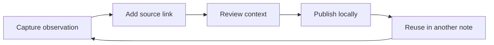

---
tags:
  - research
  - methods
  - showcase
aliases:
  - Signal study
---

# Signal Quality

The Atlas team treats a note as useful when another person can follow its evidence without opening a second application. This page records the small rubric used in the fictional spring pilot.

## What we measured

| Dimension | Question | Result |
| --- | --- | --- |
| Traceability | Can a reader follow the source link? | 12 of 12 |
| Freshness | Is the observation date visible? | 11 of 12 |
| Context | Does the note explain its constraints? | 10 of 12 |
| Reuse | Can another note link to the result? | 12 of 12 |

> [!success] Working conclusion
> Link structure is a practical quality signal: the most reusable observations are the ones with a clear source, a compact summary, and one explicit next step.

## Evidence trail

The first pass was logged in [[Research/Experiment Log]]. The publishing conventions are collected in [[Guides/Obsidian Patterns]], while the complete workflow is shown in [[Slides/VaultPub in 90 Seconds]].

## What to try next

1. Open the local graph and focus this note.
2. Hover over [[Research/Experiment Log]] to preview it without leaving the page.
3. Search for `traceability` to find this table and the linked log.

The rubric is intentionally modest. It is a conversation starter, not a claim about real-world data. #research #quality
