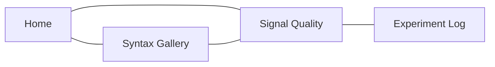

---
tags:
  - vaultpub
  - presentation
  - showcase
slide:
  theme: colorful
  transition: slide
  split: explicit
  progress: true
  slideNumber: true
  center: true
  codeWrap: true
---

# Slide View

Turn a local Markdown vault into a site you can browse, search, and present. The source for this deck is an ordinary note with explicit slide boundaries.

---

## 1. Start with your notes

Your files stay in the vault you already own.

- Markdown remains the source of truth.
- Wikilinks become navigation and graph edges.
- Attachments remain local and publishable.

[[README|Return to the Atlas home page]]

---

## 2. Explore the connections

Search, table of contents, backlinks, hover previews, and local graph navigation make a growing vault easy to scan.

Try the [[Research/Signal Quality|signal quality page]] after leaving the deck.

---

## 3. Present the same source

Open **Note in Slide View** from a published note. VaultPub segments the note without creating a second document or a special export format.

> [!success] One source, two views
> Article mode is for reading and linking. Slide View is for presenting. Both come from the same Markdown file.

---

## 4. Publish where it fits

Use the standalone server while writing, build a portable static site, or mount the reusable Django app inside an existing project.

The [[Guides/Obsidian Patterns|syntax gallery]] shows the source features used throughout this vault. #presentation #local-first
